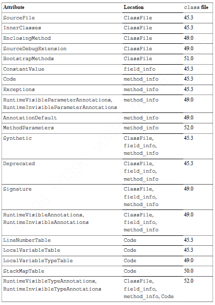
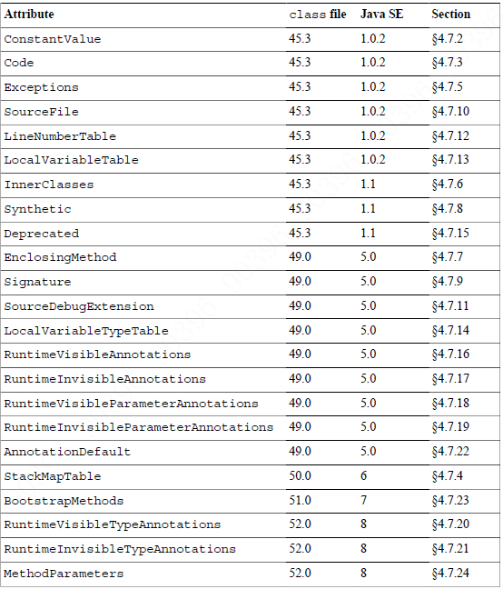
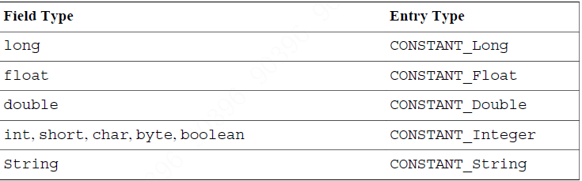
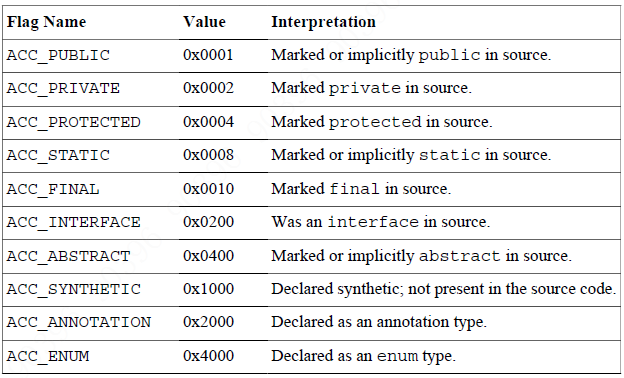
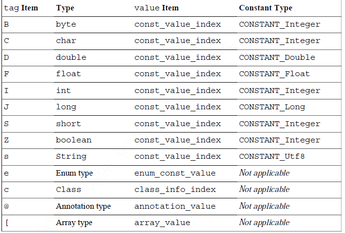
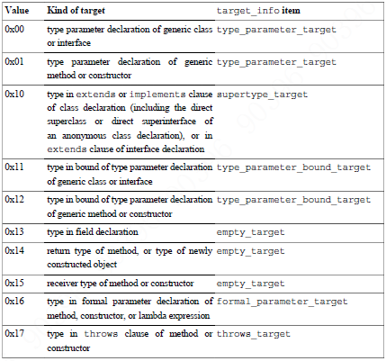
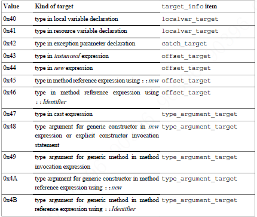
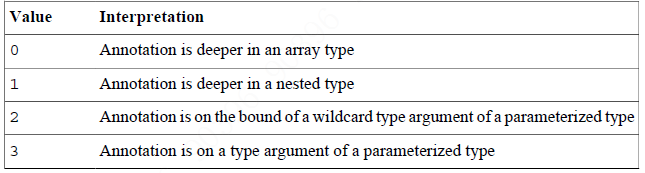

```
attribute_info {
    u2 attribute_name_index;   // 常量池中索引，必为 CONSTANT_Utf8_info
    u4 attribute_length;
    u1 info[attribute_length];
}
```
attribute_info 在ClassFile, field_info, method_info 和 Code_attribute structures 中使用  



###ConstantValue Attribute
```
ConstantValue_attribute {
    u2 attribute_name_index; // 常量池中索引，必为 CONSTANT_Utf8_info 内容为"ConstantValue" 
    u4 attribute_length;     // 2
    u2 constantvalue_index;  // 必须为下图
}
```
####constantvalue_index
  

###Code Attribute
```
Code_attribute {
    u2 attribute_name_index;   // 常量池中索引，必为 CONSTANT_Utf8_info 内容为"Code" 
    u4 attribute_length;       // 该属性的长度，去除开始的六个字节
    u2 max_stack;              // 该方法执行时最大操作数栈
    u2 max_locals;             // 该方法调用时最大本地变量数，包括调用方法时的传参
    u4 code_length;            // 该方法code 数组的字节数，范围为0-65536
    u1 code[code_length];      // 实际实现该方法的code 数组
    u2 exception_table_length; // exception_table 表中的个数
    { 
        u2 start_pc;           // 表明异常处理器在code 数组中的有效范围，包括
        u2 end_pc;             // 不包括，即[start_pc, end_pc)
        u2 handler_pc;         // 异常处理器的位置
        u2 catch_type;         // 常量池中索引，必为 CONSTANT_Class_info
    } exception_table[exception_table_length];  // 异常处理器表，每一项为一个异常处理器
    u2 attributes_count;       // code 属性中的属性个数
    attribute_info attributes[attributes_count];// 
}
```
Code attribute 是在method_info 结构中的变量长度属性。如果方法是native 或abstract 的，
它的method_info 结构中必定没有Code 属性。反之，method_info 结构中必有一个Code 属性。

###StackMapTable Attribute
StackMapTable 是Code 属性中的attributes 表中的元素，该属性用于类型校验。在Code 属性中，至多只有一个StackMapTable 属性。
在ClassFile 版本在>=50.0（Java 6） 的文件内没有该属性，则会有一个隐式的该属性，其中number_of_entries 为0。
```
StackMapTable_attribute {
    u2 attribute_name_index;                    // 常量池中索引，必为 CONSTANT_Utf8_info 内容为"StackMapTable"
    u4 attribute_length;                        // 该属性的长度，去除开始的六个字节
    u2 number_of_entries;                       // stack_map_frame 表中的个数
    stack_map_frame entries[number_of_entries]; //  
}
```
```
union stack_map_frame {
    same_frame;     // 帧类型，0-63
    same_locals_1_stack_item_frame;
    same_locals_1_stack_item_frame_extended;
    chop_frame;
    same_frame_extended;
    append_frame;
    full_frame;
}

same_frame {
    u1 frame_type = SAME; /* 0-63 */ 
}
same_locals_1_stack_item_frame {
    u1 frame_type = SAME_LOCALS_1_STACK_ITEM; /* 64-127 */
    verification_type_info stack[1];
}
same_locals_1_stack_item_frame_extended {
    u1 frame_type = SAME_LOCALS_1_STACK_ITEM_EXTENDED; /* 247 */
    u2 offset_delta;
    verification_type_info stack[1];
}
chop_frame {
    u1 frame_type = CHOP; /* 248-250 */
    u2 offset_delta;
}
same_frame_extended {
    u1 frame_type = SAME_FRAME_EXTENDED; /* 251 */
    u2 offset_delta;
}
append_frame {
    u1 frame_type = APPEND; /* 252-254 */
    u2 offset_delta;
    verification_type_info locals[frame_type - 251];
}
full_frame {
    u1 frame_type = FULL_FRAME; /* 255 */
    u2 offset_delta;
    u2 number_of_locals;
    verification_type_info locals[number_of_locals];
    u2 number_of_stack_items;
    verification_type_info stack[number_of_stack_items];
}
```
```
union verification_type_info {
    Top_variable_info;
    Integer_variable_info;
    Float_variable_info;
    Long_variable_info;
    Double_variable_info;
    Null_variable_info;
    UninitializedThis_variable_info;
    Object_variable_info;
    Uninitialized_variable_info;
}

Top_variable_info {
    u1 tag = ITEM_Top; /* 0 */
}

Integer_variable_info {
    u1 tag = ITEM_Integer; /* 1 */
}

Float_variable_info {
    u1 tag = ITEM_Float; /* 2 */
}

Null_variable_info {
    u1 tag = ITEM_Null; /* 5 */
}

UninitializedThis_variable_info {
    u1 tag = ITEM_UninitializedThis; /* 6 */
}

Object_variable_info {
    u1 tag = ITEM_Object; /* 7 */
    u2 cpool_index;
}

Uninitialized_variable_info {
    u1 tag = ITEM_Uninitialized; /* 8 */
    u2 offset;
}

Long_variable_info {
    u1 tag = ITEM_Long; /* 4 */
}

Double_variable_info {
    u1 tag = ITEM_Double; /* 3 */
}
```

###Exceptions attribute
```
Exceptions_attribute {
    u2 attribute_name_index;    // 常量池中索引，必为 CONSTANT_Utf8_info 内容为"Exceptions" 
    u4 attribute_length;        // 该属性的长度，去除开始的六个字节
    u2 number_of_exceptions;    // exception_index_table 中元素的个数
    u2 exception_index_table[number_of_exceptions]; // 常量池中索引，必为 CONSTANT_Class_info
}
```

###InnerClasses Attribute
```
InnerClasses_attribute {
    u2 attribute_name_index;         // 常量池中索引，必为 CONSTANT_Utf8_info 内容为"InnerClasses"
    u4 attribute_length;             // 该属性的长度，去除开始的六个字节
    u2 number_of_classes;            // classes 表中元素个数
    { 
        u2 inner_class_info_index;   // 常量池中索引，必为 CONSTANT_Class_info
        u2 outer_class_info_index;   // 常量池中索引，必为 CONSTANT_Class_info
        u2 inner_name_index;         // 常量池中索引，必为 CONSTANT_Utf8_info
        u2 inner_class_access_flags;
    } classes[number_of_classes];
}
```
####Nested class access and property flags(inner_class_access_flags)
  

###EnclosingMethod Attribute
```
EnclosingMethod_attribute {
    u2 attribute_name_index; // 常量池中索引，必为 CONSTANT_Utf8_info 内容为"EnclosingMethod"
    u4 attribute_length;     // 4
    u2 class_index;          // 常量池中索引，必为 CONSTANT_Class_info
    u2 method_index;         // 常量池中索引，必为 CONSTANT_NameAndType_info
}
```

###Synthetic Attribute
```
Synthetic_attribute {
    u2 attribute_name_index; // 常量池中索引，必为 CONSTANT_Utf8_info 内容为"Synthetic"
    u4 attribute_length;     // 0
}
```

###Signature Attribute
```
Signature_attribute {
    u2 attribute_name_index; // 常量池中索引，必为 CONSTANT_Utf8_info 内容为"Signature"
    u4 attribute_length;     // 2
    u2 signature_index;      // 常量池中索引，必为 CONSTANT_Utf8_info
}
```

###SourceFile Attribute
```
SourceFile_attribute {
    u2 attribute_name_index; // 常量池中索引，必为 CONSTANT_Utf8_info 内容为"SourceFile"
    u4 attribute_length;     // 2
    u2 sourcefile_index;     // 常量池中索引，必为 CONSTANT_Utf8_info
}
```

###SourceDebugExtension Attribute
```
SourceDebugExtension_attribute {
    u2 attribute_name_index; // 常量池中索引，必为 CONSTANT_Utf8_info 内容为"SourceDebugExtension"
    u4 attribute_length;     // 该属性的长度，去除开始的六个字节
    u1 debug_extension[attribute_length]; // 
}
```

###LineNumberTable Attribute
```
LineNumberTable_attribute {
    u2 attribute_name_index;    // 常量池中索引，必为 CONSTANT_Utf8_info 内容为"LineNumberTable"
    u4 attribute_length;        // 该属性的长度，去除开始的六个字节
    u2 line_number_table_length;// line_number_table 表中的个数
    { 
        u2 start_pc;            // 开始位置
        u2 line_number;         // 原始文件的行号
    } line_number_table[line_number_table_length];
}
```

###LocalVariableTable Attribute
```
LocalVariableTable_attribute {
    u2 attribute_name_index;        // 常量池中索引，必为 CONSTANT_Utf8_info 内容为"LocalVariableTable"
    u4 attribute_length;            // 该属性的长度，去除开始的六个字节
    u2 local_variable_table_length; // local_variable_table 表中的个数
    { 
        u2 start_pc;         // [start_pc, start_pc + length)
        u2 length;
        u2 name_index;       // 常量池中索引，必为 CONSTANT_Utf8_info
        u2 descriptor_index; // 常量池中索引，必为 CONSTANT_Utf8_info
        u2 index;            
    } local_variable_table[local_variable_table_length];
}
```

###LocalVariableTypeTable Attribute
```
LocalVariableTypeTable_attribute {
    u2 attribute_name_index;    // 常量池中索引，必为 CONSTANT_Utf8_info 内容为"LocalVariableTypeTable"
    u4 attribute_length;        // 该属性的长度，去除开始的六个字节
    u2 local_variable_type_table_length; // local_variable_type_table 表中的个数
    { 
        u2 start_pc;        // [start_pc, start_pc + length)
        u2 length;
        u2 name_index;      // 常量池中索引，必为 CONSTANT_Utf8_info
        u2 signature_index; // 常量池中索引，必为 CONSTANT_Utf8_info
        u2 index;
    } local_variable_type_table[local_variable_type_table_length];
}
```

###The Deprecated Attribute
```
Deprecated_attribute {
    u2 attribute_name_index; // 常量池中索引，必为 CONSTANT_Utf8_info 内容为"Deprecated"
    u4 attribute_length;     // 0
}
```

###RuntimeVisibleAnnotations Attribute
```
RuntimeVisibleAnnotations_attribute {
    u2 attribute_name_index;    // 常量池中索引，必为 CONSTANT_Utf8_info 内容为"RuntimeVisibleAnnotations"
    u4 attribute_length;        // 该属性的长度，去除开始的六个字节
    u2 num_annotations;         // annotations 表中个数
    annotation annotations[num_annotations];
}

annotation {
    u2 type_index;              // 常量池中索引，必为 CONSTANT_Utf8_info
    u2 num_element_value_pairs; // element_value_pairs 表中个数
    { 
        u2 element_name_index;  // 常量池中索引，必为 CONSTANT_Utf8_info
        element_value value;
    } element_value_pairs[num_element_value_pairs];
}

element_value {
    u1 tag; // element value tag 见下图
    union {
        u2 const_value_index;
        { 
            u2 type_name_index;
            u2 const_name_index;
        } enum_const_value;
        u2 class_info_index;
        annotation annotation_value;
        { 
            u2 num_values;
            element_value values[num_values];
        } array_value;
    } value;
}
```


###RuntimeInvisibleAnnotations Attribute
```
RuntimeInvisibleAnnotations_attribute {
    u2 attribute_name_index; // 常量池中索引，必为 CONSTANT_Utf8_info 内容为"RuntimeInvisibleAnnotations"
    u4 attribute_length;     // 该属性的长度，去除开始的六个字节
    u2 num_annotations;      // annotations 表中元素个数
    annotation annotations[num_annotations];
}
```

###RuntimeVisibleParameterAnnotations Attribute
```
RuntimeVisibleParameterAnnotations_attribute {
    u2 attribute_name_index; // 常量池中索引，必为 CONSTANT_Utf8_info 内容为"RuntimeVisibleParameterAnnotations"
    u4 attribute_length;     // 该属性的长度，去除开始的六个字节
    u1 num_parameters;       // parameter_annotations 表个数
    { 
        u2 num_annotations;  // annotations 表个数
        annotation annotations[num_annotations];
    } parameter_annotations[num_parameters];
}
```

###RuntimeInvisibleParameterAnnotations Attribute
```
RuntimeInvisibleParameterAnnotations_attribute {
    u2 attribute_name_index; // 常量池中索引，必为 CONSTANT_Utf8_info 内容为"RuntimeInvisibleParameterAnnotations"
    u4 attribute_length;     // 该属性的长度，去除开始的六个字节
    u1 num_parameters;
    { 
        u2 num_annotations;
        annotation annotations[num_annotations];
    } parameter_annotations[num_parameters];
}
```

###RuntimeVisibleTypeAnnotations Attribute
```
RuntimeVisibleTypeAnnotations_attribute {
    u2 attribute_name_index; // 常量池中索引，必为 CONSTANT_Utf8_info 内容为"RuntimeVisibleTypeAnnotations"
    u4 attribute_length;     // 该属性的长度，去除开始的六个字节
    u2 num_annotations;      // annotations 表中个数
    type_annotation annotations[num_annotations];
}

type_annotation {
    u1 target_type; // 见下图
    union {
        type_parameter_target;
        supertype_target;
        type_parameter_bound_target;
        empty_target;
        method_formal_parameter_target;
        throws_target;
        localvar_target;
        catch_target;
        offset_target;
        type_argument_target;
    } target_info;
    type_path target_path;
    u2 type_index;
    u2 num_element_value_pairs;
    { 
        u2 element_name_index;
        element_value value;
    } element_value_pairs[num_element_value_pairs];
}

type_parameter_target {
    u1 type_parameter_index;
}
supertype_target {
    u2 supertype_index;
}
type_parameter_bound_target {
    u1 type_parameter_index;
    u1 bound_index;
}
formal_parameter_target {
    u1 formal_parameter_index;
}
throws_target {
    u2 throws_type_index;
}
localvar_target {
    u2 table_length;
    { 
        u2 start_pc;
        u2 length;
        u2 index;
    } table[table_length];
}
catch_target {
    u2 exception_table_index;
}
offset_target {
    u2 offset;
}
type_argument_target {
    u2 offset;
    u1 type_argument_index;
}
type_path {
    u1 path_length;
    { 
        u1 type_path_kind;
        u1 type_argument_index;
    } path[path_length];
}
```
#####target_type
 
#####type_path_kind


###RuntimeInvisibleTypeAnnotations Attribute
```
RuntimeInvisibleTypeAnnotations_attribute {
    u2 attribute_name_index;    // 常量池中索引，必为 CONSTANT_Utf8_info 内容为"RuntimeInvisibleTypeAnnotations"
    u4 attribute_length;        // 该属性的长度，去除开始的六个字节
    u2 num_annotations;         // annotations 中个数
    type_annotation annotations[num_annotations];
}
```

###AnnotationDefault Attribute
```
AnnotationDefault_attribute {
    u2 attribute_name_index; // 常量池中索引，必为 CONSTANT_Utf8_info 内容为"AnnotationDefault"
    u4 attribute_length;     // 该属性的长度，去除开始的六个字节
    element_value default_value;
}
```

###BootstrapMethods Attribute
```
BootstrapMethods_attribute {
    u2 attribute_name_index; // 常量池中索引，必为 CONSTANT_Utf8_info 内容为"BootstrapMethods"
    u4 attribute_length;     // 该属性的长度，去除开始的六个字节
    u2 num_bootstrap_methods;// bootstrap_methods 的个数
    { 
        u2 bootstrap_method_ref;    // 常量池中索引，必为 CONSTANT_MethodHandle_info 
        u2 num_bootstrap_arguments; // bootstrap_arguments 表个数
        u2 bootstrap_arguments[num_bootstrap_arguments]; 
        // CONSTANT_String_info, CONSTANT_Class_info, CONSTANT_Integer_info, CONSTANT_Long_info,
          CONSTANT_Float_info, CONSTANT_Double_info, CONSTANT_MethodHandle_info,
          CONSTANT_MethodType_info 结构中的一种
    } bootstrap_methods[num_bootstrap_methods];
}
```

###MethodParameters Attribute
```
MethodParameters_attribute {
    u2 attribute_name_index; // 常量池中索引，必为 CONSTANT_Utf8_info 内容为"MethodParameters"
    u4 attribute_length;     // 该属性的长度，去除开始的六个字节
    u1 parameters_count;     // parameters 表中个数
    { 
        u2 name_index;       // 常量池中索引，必为 CONSTANT_Utf8_info
        u2 access_flags;     // 0x0010 (ACC_FINAL) 0x1000 (ACC_SYNTHETIC) 0x8000 (ACC_MANDATED)
    } parameters[parameters_count];
}
```

###
```

```