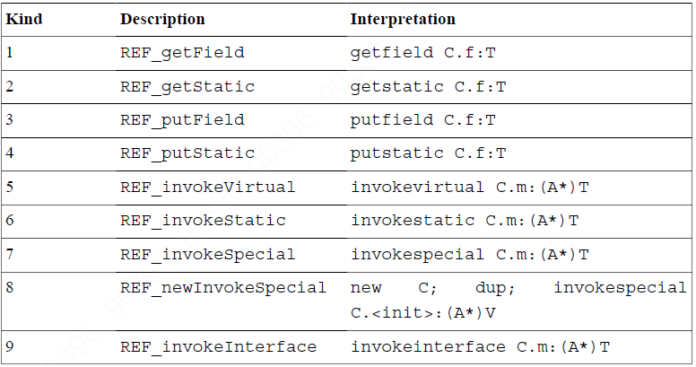

# Constant pool tags
|  Constant Type   | Value  |
|  ----  | ----  |
| CONSTANT_Class  | 7 |
| CONSTANT_Fieldref  | 9 |
| CONSTANT_Methodref  | 10 |
| CONSTANT_InterfaceMethodref  | 11 |
| CONSTANT_String  | 8 |
| CONSTANT_Integer  | 3 |
| CONSTANT_Float  | 4 |
| CONSTANT_Long  | 5 |
| CONSTANT_Double  | 6 |
| CONSTANT_NameAndType  | 12 |
| CONSTANT_Utf8  | 1 |
| CONSTANT_MethodHandle  | 15 |
| CONSTANT_MethodType  | 16 |
| CONSTANT_InvokeDynamic  | 18 |

```
CONSTANT_Class_info {
    u1 tag;         // 7
    u2 name_index;  // 常量池索引，必为CONSTANT_Utf8_info
}
```

```
CONSTANT_NameAndType_info {
    u1 tag;              // 12
    u2 name_index;       // 常量池索引，必为CONSTANT_Utf8_info
    u2 descriptor_index; // 常量池索引，必为CONSTANT_Utf8_info
}
```

```
CONSTANT_Fieldref_info {
    u1 tag;                 // 9
    u2 class_index;         // 常量池中索引，必为类 CONSTANT_Class_info
    u2 name_and_type_index; // 常量池中索引，必为CONSTANT_NameAndType_info
}
```

```
CONSTANT_Methodref_info {
    u1 tag;                 // 10
    u2 class_index;         // 常量池中索引，必为CONSTANT_Class_info
    u2 name_and_type_index; // 常量池中索引，必为CONSTANT_NameAndType_info
}
```

```
CONSTANT_InterfaceMethodref_info {
    u1 tag;                  // 11
    u2 class_index;          // 常量池中索引，必为接口 CONSTANT_Class_info
    u2 name_and_type_index;  // 常量池中索引，必为CONSTANT_NameAndType_info
}
```

```
CONSTANT_String_info {
    u1 tag;           // 8
    u2 string_index;  // 常量池中索引，必为 CONSTANT_Utf8_info
}
```

```
CONSTANT_Utf8_info {
    u1 tag; // 1
    u2 length;
    u1 bytes[length];
}
```

```
CONSTANT_Integer_info {
    u1 tag; // 3
    u4 bytes;
}
```

```
CONSTANT_Float_info {
    u1 tag; // 4
    u4 bytes;
}
```

```
CONSTANT_Long_info {
    u1 tag; // 5
    u4 high_bytes;
    u4 low_bytes;
}
```

```
CONSTANT_Double_info {
    u1 tag; // 6
    u4 high_bytes;
    u4 low_bytes;
}
```

```
CONSTANT_MethodHandle_info {
    u1 tag;             // 15
    u1 reference_kind;  // 1到9，见
    u2 reference_index; 
    // 当reference_kind = (1, 2, 3, 4) 时，为CONSTANT_Fieldref_info 的引用
    // 当reference_kind = (5, 8) 时，CONSTANT_Methodref_info 的引用
    // 当reference_kind = (6, 7) 且类版本小于52.0 时，CONSTANT_Methodref_info 的引用
    // 当reference_kind = (9) 时，CONSTANT_InterfaceMethodref_info 的引用
    // 当reference_kind = (6, 7) 且类版本大于等于52.0 时，CONSTANT_Methodref_info 或 CONSTANT_InterfaceMethodref_info 的引用
    // 当reference_kind = (5, 6, 7, 9) 时，必不为<init> 或 <clinit>
    // 当reference_kind = (8) 时，必为<init>
}
```
#### reference_kind 


```
CONSTANT_MethodType_info {
    u1 tag;              // 16
    u2 descriptor_index; // 常量池中索引，必为 CONSTANT_Utf8_info
}
```

```
CONSTANT_InvokeDynamic_info {
    u1 tag;                         // 18
    u2 bootstrap_method_attr_index; // 
    u2 name_and_type_index;         // 常量池中索引，必为CONSTANT_NameAndType_info
}
```