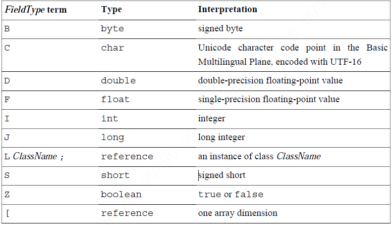

#Descriptors
##Interpretation of field descriptors

如，int 是 I  
Object 是 Ljava/lang/Object;  
double[][][] 是 [[[D.

##Method Descriptors
Object m(int i, double d, Thread t) {}  
是  
(IDLjava/lang/Thread;)Ljava/lang/Object;  

