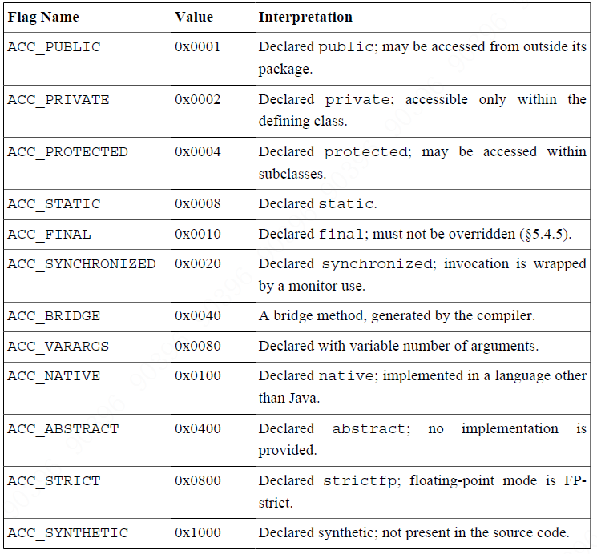

```
method_info {
    u2 access_flags;
    u2 name_index;          // 常量池中索引，必为 CONSTANT_Utf8_info
    u2 descriptor_index;    // 常量池中索引，必为 CONSTANT_Utf8_info
    u2 attributes_count;
    attribute_info attributes[attributes_count];
}
```
#### Method access and property flags
