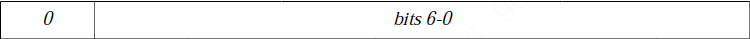
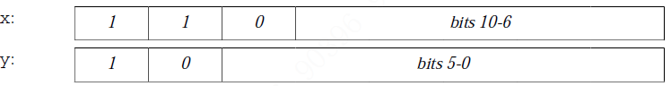
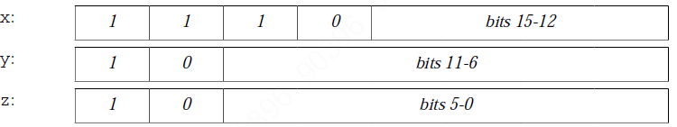
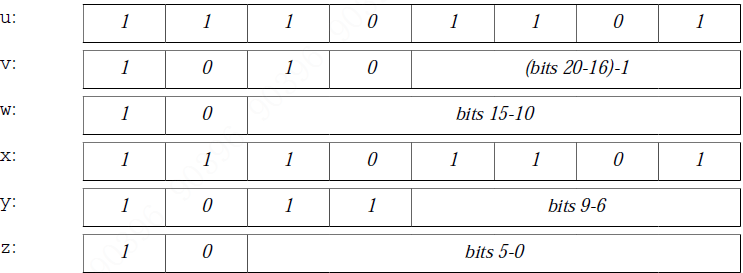

### modified UTF-8

####'\u0001' 到 '\u007F' 的码点单字节表示

####'\u0080' 到 '\u07FF' 的码点双字节

((x & 0x1f) << 6) + (y & 0x3f)

####'\u0800' 到 '\uFFFF' 的码点三字节

((x & 0xf) << 12) + ((y & 0x3f) << 6) + (z & 0x3f)

####'\uFFFF'之外的

0x10000 + ((v & 0x0f) << 16) + ((w & 0x3f) << 10) + ((y & 0x0f) << 6) + (z & 0x3f)